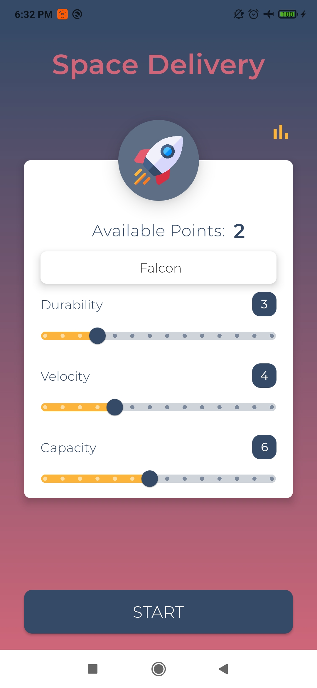
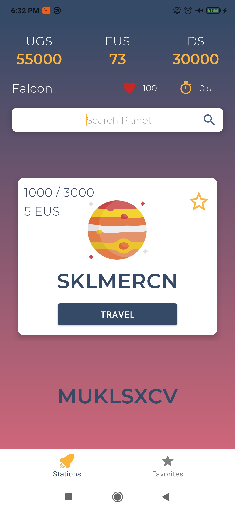
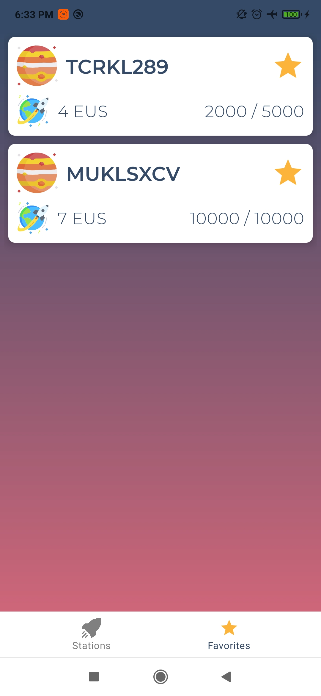
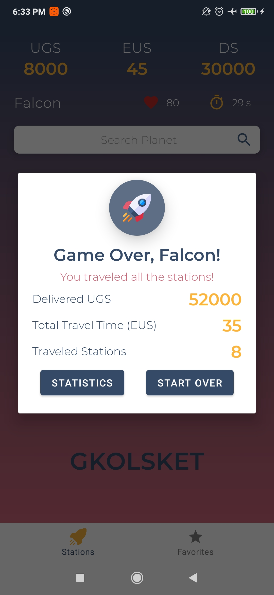
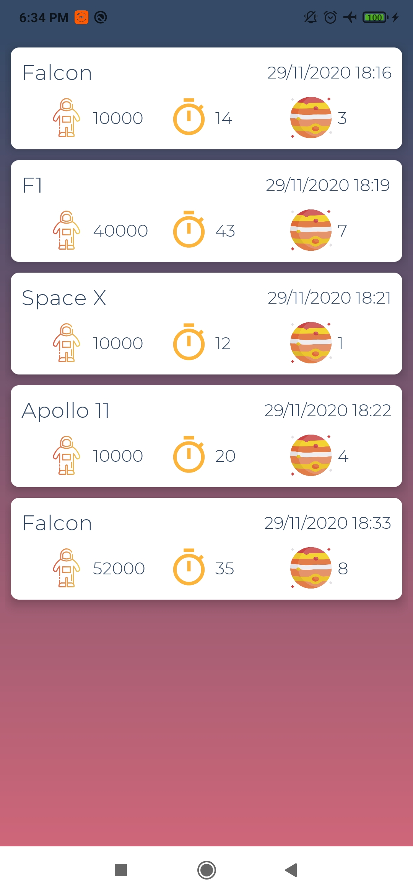

Space Delivery is an application that utilizes most of the Android Architecure Components and follows the [guidelines](https://developer.android.com/jetpack/guide) for the app architecture:
  
  • Room
  
  • LiveData
  
  • ViewModel 
  
  • Kotlin Coroutines
  
  • Navigation Components
  
  These are the screenshots from the application:
  
  

     
    
    
    
    

